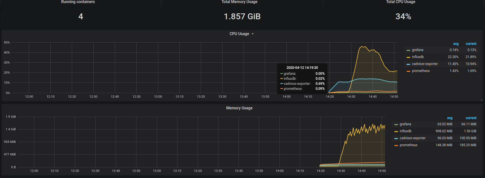
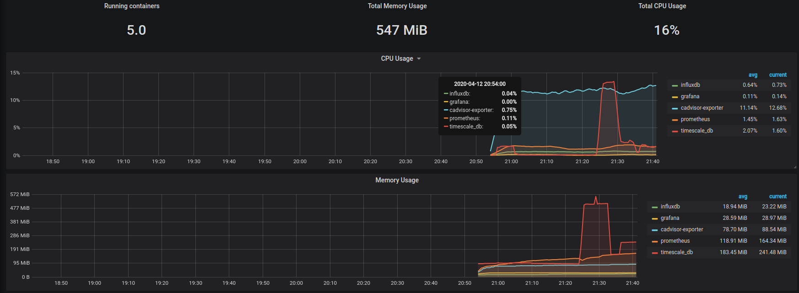

#### Influxdb
1. ~30000 итераций, ~400Мб на диске, ~1.5Гб потребляемой памяти
   

#### TimescaleDB
1. ~30000 итераций, ~300Мб на диске, ~600Мб потребляемой памяти
   
   Контейнер был перезапущен, на графике видно
   